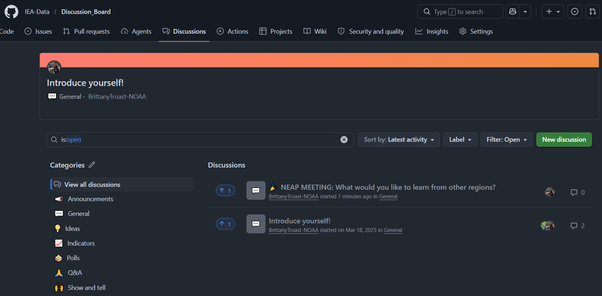
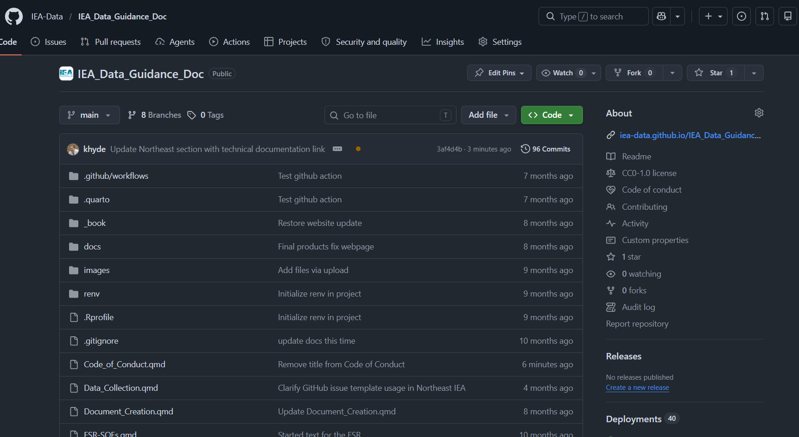

The IEA Data GitHub is meant to be a tool for you by you. Contributing is essential to creating a community that works together. Here are some ways you can contribute.

**1) [Discussion Board](https://github.com/IEA-Data/Discussion_Board/discussions)**

The Discussion board is a place to introduce yourself, ask others for advice, note ideas for the future of the NEAP program, and show off products and tools you and your team have developed. Ideally this will bring together the varying regions and help establish a more unified national identity.

{fig-align="center" width="800"}

**2) Add to the [IEA Data Guidance Doc](https://iea-data.github.io/IEA_Data_Guidance_Doc/)**

The IEA Data Guidance Document is an internal resource for NEAP members to reference. Unlike public facing websites that focus on disseminating finished products, this website emphasizes the inner workings of IEA projects like timelines, workflows, works in progress, and associated tools. Documenting your region's methods prevents us from reinventing the wheel and allows every team to build upon our collective progress.

To contribute to the IEA Data Guidance Document, you can create a new branch in the GitHub repo, edit the guidance document as you see fit, and create a pull request. IEA Data working group members will review your edits and merge your branch. If you are new to GitHub please explore these [resources](https://openscapes.org/blog/2022-05-27-github-illustrated-series/) from the Openscapes program.

{fig-align="center" width="800"}
