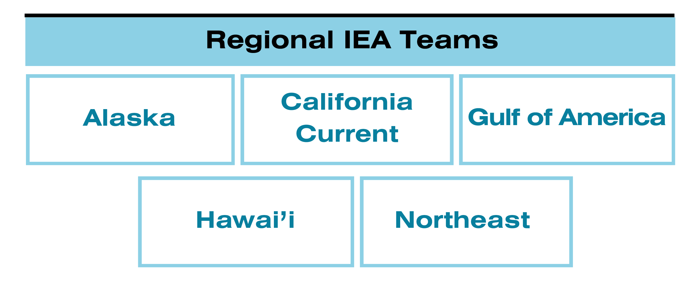

# About this document {.unnumbered}

**PROBLEM:**  IEA products are co-developed with end users to address regional resource management needs. This process results in a range of ecosystem tools, expertise, processes, and products available across NOAA's regions. Development of a centralized platform enables inter-regional sharing, adoption, and production of these IEA products and tools to more efficiently support ecosystem-based fisheries management (EBFM)/ ecosystem-based management (EBM). 

**PURPOSE OF WEBSITE:** The IEA Data WG Github repositories serve as a central platform for documenting key regional products and the methodologies supporting NOAA’s Ecosystem Status and State of the Ecosystem Reports..

These operational reports and products provide ecosystem science to regional fishery management councils and other community groups that manage marine resources. They are each co-developed with their respective end users following the steps of the IEA loop (pictured), resulting in indicator driven, reproducible, operational products that are similar in purpose (informing resource management decisions), but containing content that is unique to fulfilling the needs of the end user(s). 

**GOAL:** The goal of this Github space is for IEA practitioners to have shared access to data-stewardship best practices, methodologies, data, and code that are kept current through ongoing communication and collaboration, within and across regions. Access to these materials will facilitate more efficient and transparent product development and creation. 

**AUDIENCE:** This platform is intended for internal NOAA use, specifically IEA/National Ecosystem Assessment Program members who contribute to data management and product development. 

## IEA regions

**ALASKA**
The Ecosystem Status Reports provide the North Pacific Fishery Management Council, including its Scientific and Statistical Committee (SSC) and Advisory Panel (AP), with information on ecosystem status and trends in the Gulf of Alaska, Aleutian Islands, and Bering Sea. This information provides context for the SSC’s acceptable biological catch (ABC) and overfishing limit (OFL) recommendations, as well as the Council’s final total allowable catch (TAC) determination for groundfish and crab. The ecosystem information in this report is integrated into the annual harvest recommendations through inclusion in stock assessment-specific risk tables (Dorn and Zador, 2020), presentations to the Groundfish and Crab plan teams in annual September and November meetings, presentations to the Council in their annual October and December meetings, and submission of the final report to the Council in December. In addition, ‘In Brief’s are 4-page outreach reports produced to summarize the Ecosystem Status Reports for a broader audience.

**CCIEA**
The California Current Integrated Ecosystem Assessment (CCIEA) supports ecosystem-based management of the California Current marine ecosystem by providing an annual [Ecosystem Status Report (ESR)](https://www.integratedecosystemassessment.noaa.gov/regions/california-current/california-current-ecosystem-status-reporting) and related web-based tools to facilitate management and tracking of the states of ecological integrity and human wellbeing along the West Coast. The ESR provides the Pacific Fishery Management Council with a yearly update on the status of the California Current Ecosystem (CCE), as derived from environmental, biological, economic and social indicators. This report has been produced annually since 2013.

**GULF**
The Gulf integrated ecosystem assessment team is currently developing three ecosystem status reports for the southeast United States. These reports include the Gulf of America, the U.S. Caribbean, and the U.S. South Atlantic. After initial development, these reports will be updated annually, with larger improvements and review every three years. Reports focus on supporting fishery management councils, and cover categories including ecosystem protection, risk, food production, socio-economic health, bycatch, and waste reduction.

**NORTHEAST**
The [State of the Ecosystem (SOE)](https://www.fisheries.noaa.gov/new-england-mid-atlantic/ecosystems/state-ecosystem-reports-northeast-us-shelf) reports provide a synthesis of the current status of the Northeast Shelf marine ecosystems (Georges Bank, Gulf of Maine, and the Mid-Atlantic Bight). They are developed for the [New England](https://www.nefmc.org/) and the [Mid-Atlantic](https://www.mafmc.org/) Fishery Management Councils. These annual, collaboratively produced reports inform the councils about [ecological](https://www.fisheries.noaa.gov/new-england-mid-atlantic/ecosystems/northeast-ecosystem-dynamics-and-assessment-our-research), [oceanographic](https://www.fisheries.noaa.gov/new-england-mid-atlantic/ecosystems/monitoring-ecosystem-northeast), and [socioeconomic](https://www.fisheries.noaa.gov/new-england-mid-atlantic/socioeconomics/socioeconomic-cultural-and-policy-research-northeast) aspects of the ecosystem—from fishing engagement to [climate](https://www.fisheries.noaa.gov/new-england-mid-atlantic/climate/climate-change-northeast-us-shelf-ecosystem) conditions.

