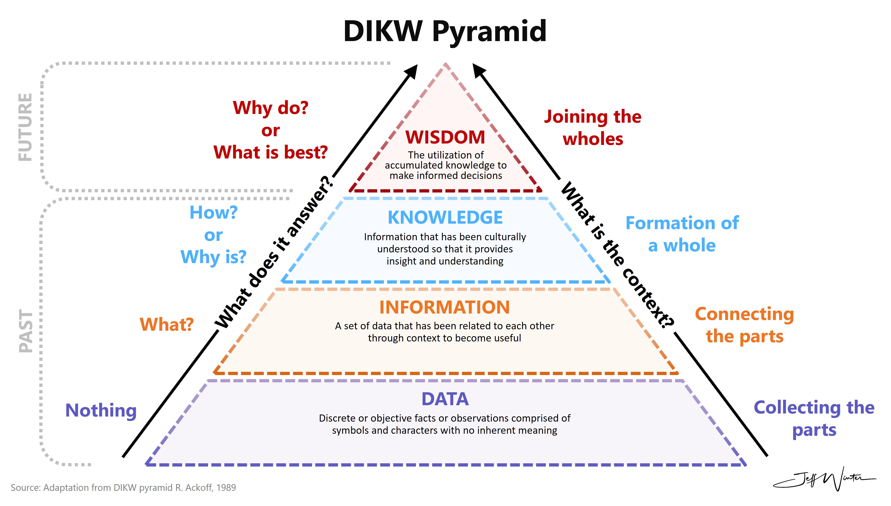

## Data Life Cycle
* Why is data important?
  + In a knowledge based society, data is what leads to success. Data and reproducibility create trust and decision making. 
  + Properly curated, data and geospatial products can lead to large societal and economic returns. 
  + When data is used as a resource for future products it becomes an indispensable asset. 
 
[]

## What is Data Management?

## FAIR Data Compliance

## Open Data Policies within NOAA
For data compliance standards, please refer to the [NOAA One Stop Data and Metadata Improvement Tiers](https://www.ncei.noaa.gov/sites/default/files/2021-08/OneStop-Data-and-Metadata-Improvement-Tier%20Guidance-v2.1.pdf)

## Archiving options
[Navigating NCEI Presentation](https://docs.google.com/presentation/d/14tG4yd7CVB0JBQ4_rGdalIQSAjPqY1YU6-nqTv9Ul2E/edit?slide=id.g3fb4569a108_1_119#slide=id.g3fb4569a108_1_119)
